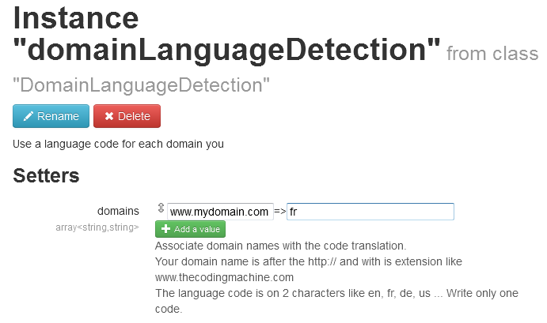
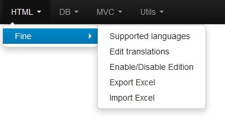
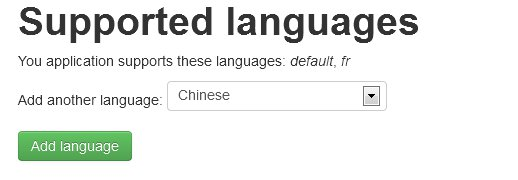
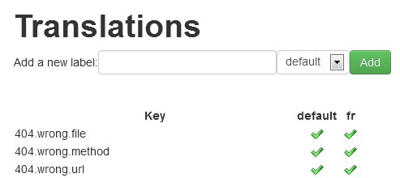
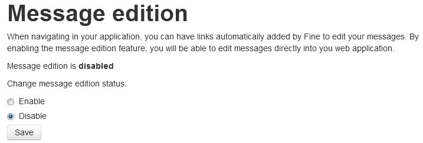
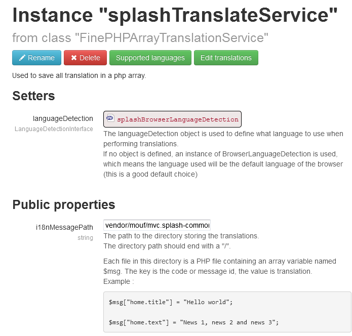

Internationalisation with FINE
==============================

Fine is an internationalisation package. It will help you develop applications that
support several languages. FINE means: Fine is not English :).
Translation is performed using PHP mapping files, but you will have a nice graphical interface 
in the Mouf framework to write your own translated messages.

In this document, we will describe how to use FINE to support several languages in your application.

Installing Fine
---------------

Fine is a Mouf package. It is part of the "common/i18n" directory. Since it is a Mouf package, it can be easily installed using the Mouf package installer.
Once you installed Fine, you must create the first instance of a LanguageTranslation named translationService. You can see it in the "Mouf status".


Click on the link to create the new instance of FinePHPArrayTranslationService. The name must be "translationService".
After it, the FinePHPArrayTranslationService component needs 2 properties:

 - i18nMessagePath: folder of the file where the translation is stored;
 - languageDetection: create an instance to detect the language


If you use the domaineLanguageDetection, you must add value to the array. There are 2 values:
 - domain: name domain. Example: www.thecodingmachine.com;
 - value: only code language. Exemple: en




In the administration, you should see 3 new menus in the Mouf User Interface:


Using the Fine User Interface
-----------------------------

Fine uses the "browser" default language to decide in which language the message should be displayed.
If the language is not available (for instance if the browser language is "Chinese", but if there is no chinese translataion,
Fine will use the "default" language.
The "Supported languages" menu will help you add new supported languages:


By clicking on the "Find Missing Labels" menu, a screen listing all existing labels will be displayed:


On this page, the list of all translated labels is shown in a table. There is one column for each language.
In the sample screenshot, there are 2 supported languages: the default language and French. On this screen,
we can see that we forgot to provide a valid translation for the label "login.password" in French.

We can use this screen to add new labels too.

Using Fine in your PHP code
---------------------------

Adding new translated messages is very useful, but we still need to be able to display them in the correct language.
Fine defines 2 useful functions: ```eMsg``` or ```iMsg```.
```eMsg``` will display the translated label in the output. For instance:
```
// This function will display the "login.password" label in the browser's language.
eMsg("login.password");
```
```iMsg``` is similar to <em>eMsg</em> excepts it returns the label instead of displaying it. For instance:
```
$passwordLbl = iMsg("login.password");
```

Labels with parameters
----------------------
Labels can contain parameters. In this case, parameters will be inserted at runtime, when calling the ```iMsg``` or ```eMsg``` functions.
For instance:
```
// The label you defined
form.invalidMail="Error. {mail} is not a valid mail."

// How to call the eMsg function. 
eMsg("form.invalidMail", array('mail'=>$mail)).
```
The ```{mail}``` label will be dynamically replaced with the "$mail" variable.

Dynamically translating your code
---------------------------------

Fine has a very nice feature called "automated message translation". You can enable or disable this mode using the "Enable/Disable translation" menu.



When this mode is enabled, in your application, all labels will have a trailing "edit" link. By clicking on this link, you will be directed to the "translation" page.<br />
You must add session_start function in your application to use this functionnality !

A normal page (translation disabled)


A page with translation enabled


Where are messages stored
-------------------------

All your translated messages are stored in the /resources directory of your project.
The translated messages are stored as PHP files. <b>message.php</b> contains the messages for the default language. <b>message_fr.php</b> will contain the
language translations for French, etc...

Best practices
--------------

All your application's labels will be stored in the same file. Since an application can contain thousands of labels, 
it can quickly become a mess.
In order to keep labels organized, we recommend to organize labels using a "suffix". For instance, all labels
related to the login screen could start with "login.".
The login labels would therefore look like this:
 - 404.wrong.file
 - 404.wrong.method
 - 404.wrong.url
 
Only very broad and common labels (like "yes", "no", "cancel"...) should have no prefix.

Advanced features: translation
------------------------------

With the FinePHPArrayTranslationService class, you can translate each component separately. You should see 2 new menus in the right. They work like the same link to the left
